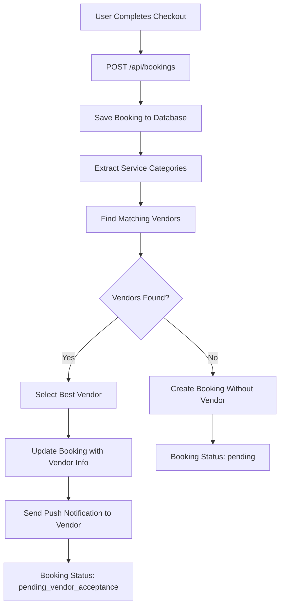
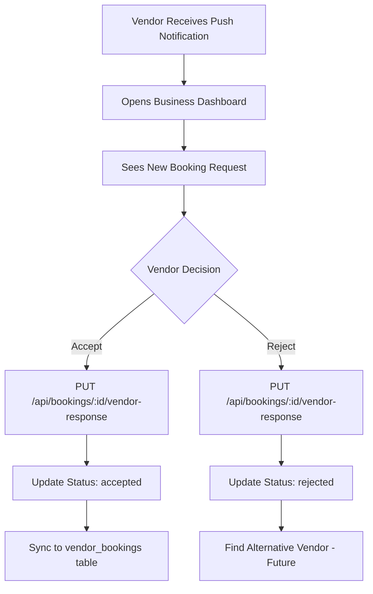

# Vendor Matching System Implementation

## Overview

This document describes the complete vendor matching system that automatically assigns bookings to vendors based on service categories stored in the `ready_services_vendors_data` table.

## System Flow

### 1. User Service Selection
When a user selects services from the "Our Services" section on the booking home page:
- Services are added to cart with category information
- User proceeds through the existing cart/checkout flow
- No new UI components needed - everything integrates with existing cart system

### 2. Booking Creation with Vendor Matching

When the user completes checkout via `CartSummary.tsx` → `checkout.tsx` → `ServicesBookingProcessConfirmation.tsx`:



### 3. Vendor Notification & Response



## Database Tables

### ready_services_vendors_data
```sql
CREATE TABLE ready_services_vendors_data (
    id SERIAL PRIMARY KEY,
    vendor_id INTEGER NOT NULL,
    vendor_email VARCHAR(255) NOT NULL,
    selected_categories JSONB NOT NULL,  -- ["bridal", "haircare", "mehendi"]
    service_setup_type VARCHAR(50) DEFAULT 'ready',
    created_at TIMESTAMP DEFAULT CURRENT_TIMESTAMP,
    updated_at TIMESTAMP DEFAULT CURRENT_TIMESTAMP
);
```

### booking_all_details_of_user_to_vendor (Enhanced)
```sql
-- New columns added for vendor matching:
ALTER TABLE booking_all_details_of_user_to_vendor 
ADD COLUMN vendor_notes TEXT,
ADD COLUMN vendor_response_time TIMESTAMP,
ADD COLUMN status VARCHAR(100) DEFAULT 'pending'; -- Updated to include 'pending_vendor_acceptance'
```

## API Endpoints

### 1. Create Booking with Vendor Matching
```http
POST /api/bookings
Content-Type: application/json

{
  "items": [
    {
      "id": "service_1",
      "name": "Bridal Makeup",
      "price": 5000,
      "category": "bridal",  // KEY: Used for vendor matching
      "quantity": 1
    }
  ],
  "selectedDate": "2024-01-25",
  "selectedTime": "14:00",
  "paymentMethod": "UPI",
  "totalAmount": 5000,
  "customerName": "Customer Name",
  "customerEmail": "customer@email.com",
  "customerPhone": "9876543210",
  "address": "Customer Address"
}
```

**Response:**
```json
{
  "success": true,
  "message": "Booking created successfully with vendor matching",
  "data": {
    "bookingId": "BK1703567890123",
    "vendorMatchingResult": {
      "success": true,
      "vendorsNotified": 1,
      "selectedVendor": {
        "id": 35,
        "name": "Vendor Name",
        "email": "vendor@email.com",
        "phone": "9876543210"
      }
    }
  }
}
```

### 2. Vendor Response to Booking
```http
PUT /api/bookings/:bookingId/vendor-response
Content-Type: application/json

{
  "vendorId": 35,
  "action": "accept", // or "reject"
  "vendorNotes": "Optional notes from vendor"
}
```

### 3. Get Pending Vendor Requests
```http
GET /api/bookings/vendor/:vendorId/pending
```

## Vendor Matching Algorithm

The algorithm works as follows:

1. **Extract Categories**: Extract service categories from booking items
2. **Query Vendors**: Find vendors with matching categories using SQL:
   ```sql
   WITH vendor_categories AS (
     SELECT rsv.vendor_id, rsv.selected_categories, reg.person_name, reg.verification_status
     FROM ready_services_vendors_data rsv
     JOIN registration_and_other_details reg ON rsv.vendor_id = reg.sr_no
     WHERE reg.verification_status = 'verified'
   )
   SELECT * FROM vendor_categories
   WHERE EXISTS (
     SELECT 1 FROM jsonb_array_elements_text(selected_categories) AS category
     WHERE LOWER(TRIM(category)) = ANY($1)  -- $1 = cleaned service categories
   )
   ```
3. **Select Best Vendor**: Currently selects first match, can be enhanced with:
   - Rating-based selection
   - Distance-based selection
   - Availability-based selection
4. **Update Booking**: Assign vendor to booking
5. **Send Notification**: Push notification to selected vendor

## Frontend Integration

### Service Selection (Existing)
The system integrates with existing service selection in:
- `booking-home.tsx` - "Our Services" section
- `service-details.tsx` - Service details and cart
- `CartSummary.tsx` - Cart checkout

### Vendor Dashboard (Enhanced)
Updates to `business-dashboard.tsx`:
- New booking status: `'pending_vendor_acceptance'`
- Enhanced `handleBookingAction()` to call vendor response API
- Automatic sync to `vendor_bookings` table on acceptance

## Service Categories

Common service categories used for matching:
- `bridal` - Bridal makeup and services
- `haircare` - Hair cutting, styling, coloring
- `mehendi` - Henna/Mehendi services
- `facial` - Facial treatments
- `massage` - Massage and spa services
- `grooming` - General grooming services

## Notification System

Uses Expo Push Notifications:
- Sent when vendor is matched to booking
- Contains booking details, customer info, earnings estimate
- Vendor opens business dashboard to respond

## Testing

### Test Script
```bash
node test_vendor_matching.js
```

This script:
1. Creates a test booking with specific categories
2. Verifies vendor matching works
3. Tests notification system
4. Optionally tests vendor response

### Manual Testing Steps

1. **Setup Test Vendor**:
   ```sql
   INSERT INTO ready_services_vendors_data 
   (vendor_id, vendor_email, selected_categories) 
   VALUES (35, 'test@vendor.com', '["bridal", "haircare"]');
   ```

2. **Create Test Booking**:
   - Add services with categories to cart
   - Complete checkout process
   - Verify vendor matching occurs

3. **Test Vendor Response**:
   - Open business dashboard as vendor
   - Accept/reject the booking
   - Verify status updates

## Configuration

### Environment Variables
```bash
DB_USER=postgres
DB_HOST=localhost
DB_NAME=muadatabase
DB_PASSWORD=your_password
DB_PORT=5432
```

### Database Migration
```bash
node run_ready_services_vendors_data_migration.js
```

## Error Handling

The system includes comprehensive error handling:
- Fallback to regular booking if vendor matching fails
- Graceful handling of notification failures
- Database connection fallbacks
- Invalid category handling

## Future Enhancements

1. **Smart Vendor Selection**:
   - Rating-based selection
   - Distance/location-based matching
   - Availability checking
   - Load balancing

2. **Alternative Vendor Matching**:
   - If vendor rejects, find alternative vendors
   - Customer notification of rejection
   - Automatic re-matching

3. **Vendor Preferences**:
   - Time slot preferences
   - Service type preferences
   - Customer type preferences

4. **Analytics**:
   - Vendor matching success rates
   - Response time tracking
   - Customer satisfaction metrics

## Troubleshooting

### Common Issues

1. **No Vendors Found**:
   - Check if vendors have matching categories in ready_services_vendors_data
   - Verify vendor verification_status = 'verified'
   - Check category name matching (case-sensitive)

2. **Notifications Not Sent**:
   - Verify vendor has valid push_token
   - Check Expo push notification service
   - Review notification service logs

3. **Vendor Response Fails**:
   - Check vendor ID matches booking assignment
   - Verify database permissions
   - Check API endpoint accessibility

### Debug Commands

```bash
# Check vendor categories
SELECT * FROM ready_services_vendors_data WHERE vendor_email = 'vendor@email.com';

# Check booking status
SELECT booking_id, vendor_id, status FROM booking_all_details_of_user_to_vendor 
WHERE booking_id = 'BK123456';

# Check vendor verification
SELECT sr_no, person_name, verification_status FROM registration_and_other_details 
WHERE business_email = 'vendor@email.com';
```

## Implementation Status

✅ **Completed**:
- Vendor matching algorithm
- Booking creation with vendor assignment
- Push notification system
- Vendor response handling
- Frontend integration
- Database schema updates

🔄 **In Progress**:
- Testing and optimization

🚧 **Future Work**:
- Alternative vendor matching
- Smart vendor selection
- Advanced analytics 